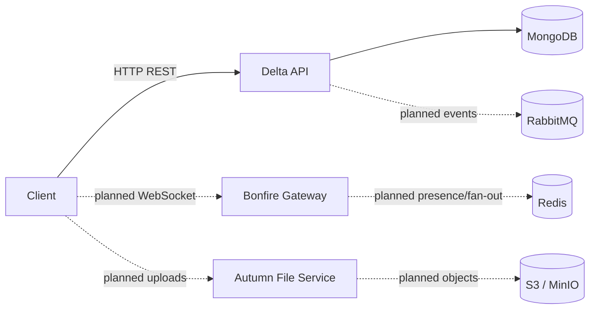

# Go-Echelon

Go-Echelon is a Go implementation of a real-time community and chat backend inspired by the Stoat/Revolt service architecture. The project is being built incrementally: the current working service is **Delta**, the REST API; the remaining services are planned and documented in [`docs/architecture`](docs/architecture/README.md).

See the [architecture overview](docs/architecture/README.md) for the intended system and [ADRs](docs/decision/ADR-001.md) for recorded technical decisions.

## Prerequisites

- Go 1.25 or later
- MongoDB 6+ running locally or reachable through a connection URI
- A Brevo API key if you want registration emails to be delivered

## Local setup

1. Copy the environment template:

   ```sh
   cp .env.example .env
   ```

2. Update `.env` with local, non-production values. At minimum, MongoDB must be available at `MONGO_URI`.

3. Download Go dependencies and start Delta:

   ```sh
   go mod download
   go run ./cmd/delta
   ```

4. Verify the service:

   ```sh
   curl http://localhost:8080/health
   ```

Swagger UI is available at `http://localhost:8080/swagger/index.html`.

## Configuration

Configuration is read from `.env` and environment variables. Do not commit `.env` or real secrets.

| Variable | Required | Purpose |
| --- | --- | --- |
| `MONGO_URI` | Yes | MongoDB connection string. |
| `DB_NAME` | Yes | MongoDB database name. |
| `PORT` | Yes | Delta HTTP port. |
| `BREVO_API_KEY` | For email OTP delivery | Brevo transactional email API key. |
| `ACCESS_SECRET` | Yes for authenticated flows | HMAC secret for access JWTs. |
| `REFRESH_SECRET` | Yes for authenticated flows | HMAC secret for refresh JWTs. |
| `JWT_SECRET` | Currently loaded but not yet used consistently | Kept temporarily for compatibility; see ADR-001. |

Use long random values for the token secrets. Production configuration must come from a secret manager or deployment environment, never a committed file.

## Commands

| Command | Purpose |
| --- | --- |
| `go run ./cmd/delta` | Run the Delta REST API. |
| `go run ./pkg/services/autumn` | Run the current Autumn placeholder process. |
| `go test ./...` | Run the test suite. |
| `go vet ./...` | Run Go static checks. |
| `go fmt ./...` | Format Go packages. |

## API conventions

- API base path: `/api/v1`.
- Requests and responses use JSON unless an endpoint explicitly supports uploads.
- Protected endpoints will use `Authorization: Bearer <access-token>`.
- Resource IDs are currently MongoDB ObjectIDs; the message ID strategy is still to be finalized before message endpoints are implemented.
- Timestamps are stored and returned in UTC.
- New endpoints should return appropriate HTTP status codes and a stable JSON error shape, for example `{"error":"message"}`. A typed error contract will be introduced before the public API expands.
- Route handlers must use the authenticated user from middleware, not a user ID supplied in a request body.

## Repository layout

```text
cmd/delta/                 Delta REST API executable
pkg/core/config/           Configuration loading
pkg/core/database/         Storage interfaces and MongoDB driver
pkg/core/models/           Shared persisted/API models
pkg/delta/                 Delta routes, middleware, and utilities
pkg/services/autumn/       File-service placeholder; planned independent service
internal/email/            OTP email delivery integration
api/                       Generated Swagger/OpenAPI files
docs/architecture/         System architecture documentation
docs/decision/             Architecture Decision Records (ADRs)
```

## Architecture at a glance



Solid connections are implemented today; dashed connections are planned.

## Documentation

- [Architecture overview](docs/architecture/README.md)
- [ADR-001: modular monolith with service-ready boundaries](docs/decision/ADR-001.md)

