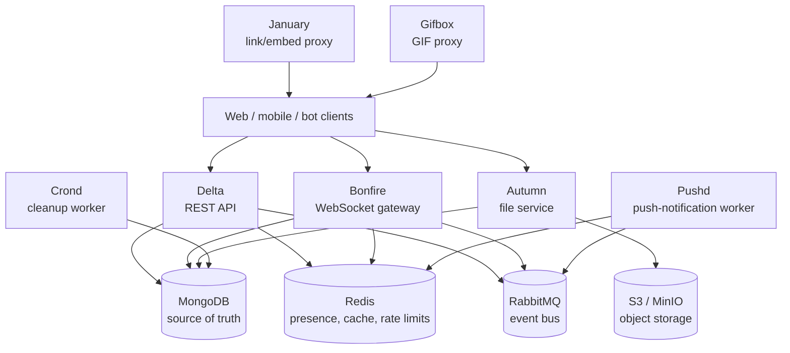

# Architecture

This directory describes the intended Go-Echelon backend architecture and distinguishes the current implementation from planned work. It is the technical reference for system boundaries; implementation work should not be assumed complete merely because a model exists.

## Target topology

## Service responsibilities

| Component | Responsibility | Status |
| --- | --- | --- |
| Delta | REST API, authentication, authorization, chat write path | Partially implemented |
| Bonfire | Authenticated WebSocket connections and real-time event fan-out | Planned |
| Autumn | Upload validation, file metadata, object storage, thumbnails | Placeholder only |
| January | Safe link metadata/image proxying | Planned |
| Gifbox | GIF-provider proxy | Planned |
| Crond | Expiry and cleanup jobs | Planned |
| Pushd | Offline push notifications | Planned |
| MongoDB | Durable application data | In use for users and sessions |
| Redis | Presence, cache, rate limits, idempotency | Planned |
| RabbitMQ | Asynchronous domain-event bus | Planned |
| S3 / MinIO | Durable file objects | Planned |

## Current code boundaries

- `cmd/delta` starts the implemented REST API.
- `pkg/core` contains reusable models, configuration, database abstractions, and utilities.
- `pkg/delta` contains the Delta-specific HTTP layer.
- `pkg/services/autumn` is intentionally separate from Delta but is not operational yet.

The project follows the decision in [ADR-001](../decision/ADR-001.md): start with a modular Go application, while preserving clear boundaries for services that will need separate deployment and scaling.

## Data ownership

- MongoDB is the durable source of truth for users, sessions, servers, members, channels, messages, and file metadata.
- Redis must only contain rebuildable/ephemeral state such as presence and rate-limit counters.
- S3/MinIO will store file bytes; MongoDB will store file metadata and ownership.
- RabbitMQ will carry state-change events only after their durable database write succeeds.

## Documentation rules

- Update this directory when a component boundary, data owner, or externally visible protocol changes.
- Add an ADR for decisions that are costly to reverse or affect multiple services.
- Mark documentation as planned until routes, persistence, authorization, tests, and operational behavior exist.

